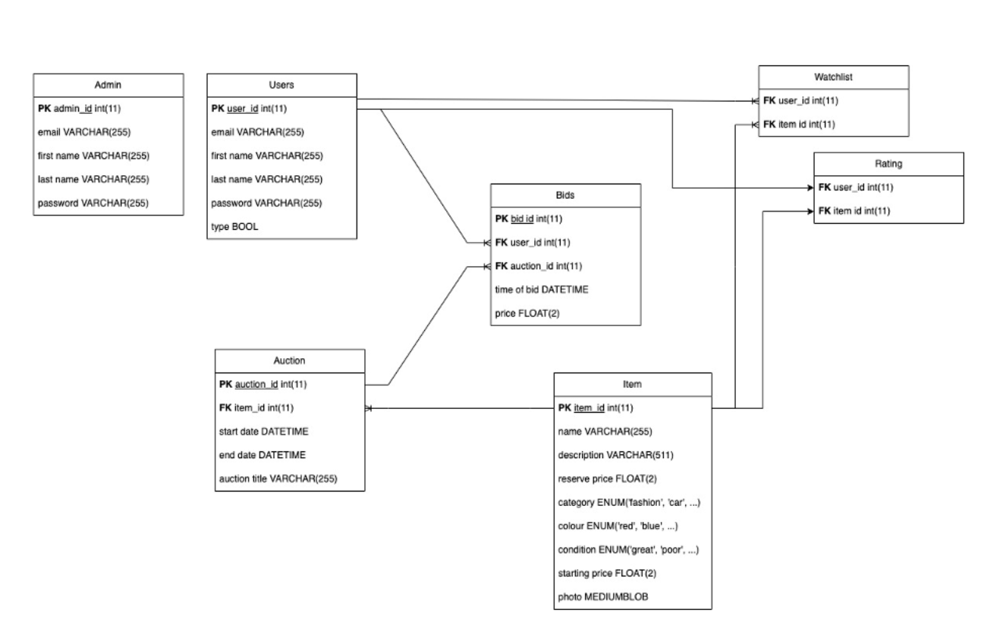
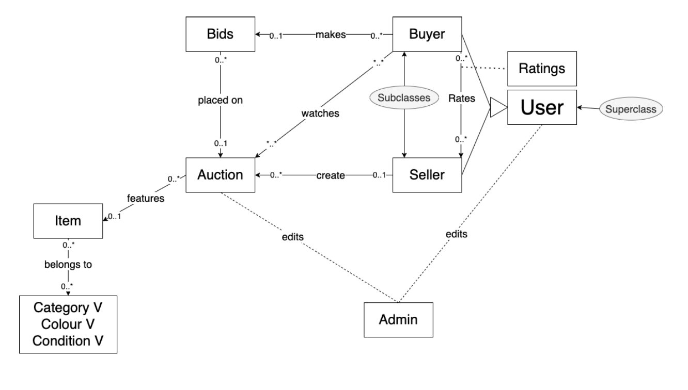

# Auction Website

Welcome to our Auction Website, a dynamic and user-friendly platform designed for both buyers and sellers. This project is a comprehensive system that allows users to auction items in an efficient and secure manner.

## Features

- **User Registration**: Users can register as either a buyer or a seller, providing essential details like email, first name, last name, and password.
- **Auction Creation**: Sellers have the ability to create auctions, setting details such as item name, description, starting and reserve price, category, color, and condition.
- **Bidding System**: Buyers can browse through available auctions and place bids on items of interest.
- **Watchlist**: Users can add items to their watchlist for easy tracking.
- **Ratings**: Buyers can rate sellers, providing feedback on their experience.

## Entity Relationship Diagram (ERD)

The ERD outlines the logical relationships between different entities in the project. Key aspects include:

- Sellers can create multiple auctions.
- Buyers can place multiple bids and rate sellers.
- Items can be featured in multiple auctions and belong to categories.
- Users can watch multiple auctions.

## Database Schema

Our database schema is meticulously designed to support the website's functionality, ensuring data integrity and efficient retrieval. The schema includes tables for admins, users, items, auctions, bids, watchlists, and ratings, each serving a specific purpose in the system.

## Initializing the Database

To get started with the project:

1. **Create the Database**: Use `create.sql` to set up the database structure.
2. **Populate with Dummy Data**: Use `dummy_data.sql` to fill the database with initial data for testing.

## Running the Application

1. **Download MAMP**: [MAMP Download Link](https://www.mamp.info/en/downloads/)
2. **Start the Server**: Launch MAMP and start the server from the root directory of the application.

